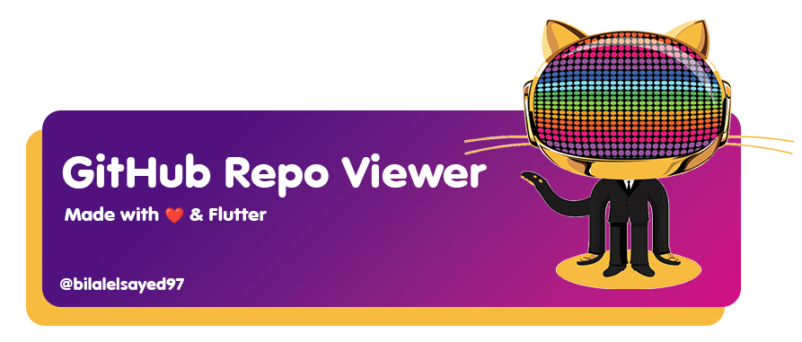

# Github Repo Viewer

Complex GitHub client app with all the best practices applied.

  
  
  
  
  
  
  
    
    
    

## Used technologies:

Flutter, Dart, Figma, REST API, OAuth, Bloc, Clean Architecture, Caching , pagination, Design Patterns, SOLID Principles, Dependency injection, Responsive.

### In this project

- 🚀 Clean Architecture
    o Commencing development on Repo Viewer, a sophisticated GitHub client app.
  
    o In-depth exploration of best practices for architecting intricate apps.
  
    o Initiating, covering essential aspects beyond initial expectations.
  
- 🧑‍💻 OAuth2 Authentication Implementation
  
    o implementing OAuth2 protocol for remote server authentication.
  
    o Development of a robust solution for seamless sign-in to Flutter apps.
  
    o Ensuring secure token persistence to eliminate the need for frequent user sign-ins.
  
- 👔 Paginated Data Local Cashing and UI Integration
  
    o Acquiring paginated data from the server
  
    o Implementing local caching.
  
    o Displaying starred GitHub repositories of signed-in users in the app's user
      interface.
    o Creation of remote and local services for managing paginated data, repositories, and application layer classes.
  
- ✏️ Code Duplication Removal and Search Functionality
  
    o Application of techniques to efficiently remove duplicated code from the codebase.
  
    o Abstractions without compromising the existing code.
  
    o Integration of a user-friendly search functionality into the Repo Viewer app for GitHub repository searches.
  
- 🧐 WebView Integration and Data Consolidation

 o Incorporation of WebView to display classic HTML content, focusing on the README file of GitHub repositories.
 
 o proper usage of WebView and addressing prerequisites for HTML content rendering.
 
 o Consolidating data from multiple requests to enhance overall app performance.
      
- 🌐 Internationalization (i18n) and Platform-specific Plugin Development
  
   o Support Multiple Languages
        ▪ Enable the app to be presented in different languages, allowing users to choose their preferred language.
   o Adapt to Cultural Differences
        ▪ Consider cultural nuances in date formats, number systems, and other aspects to create a more inclusive user experience.
  o Facilitate Localization
        ▪ Use tools and processes that make it easy to adapt the app's content and user interface to specific languages and regions.
  o Emphasis on the necessity of app internationalization (i18n) in the global market.
  o Implementation of multi-language support (Localization).
  o Mastery of platform-specific functionality through the creation of plugins for Android, iOS, and web platforms using Dart codebase.

#### Used libraries

  animated_text_kit
  
  auto_route
  
  bloc
  
  cached_network_image
  
  collection
  
  cupertino_icons
  
  dartz
  
  dio
  
  equatable
  
  flash
  
  flutter_bloc
  
  flutter_secure_storage
  
  flutter_spinkit
  
  fluttertoast
  
  freezed_annotation
  
  gap
  
  get_it
  
  http
  
  json_annotation
  
  material_design_icons_flutter
  
  material_floating_search_bar
  
  oauth2
  
  path
  
  path_provider
  
  sembast
  
  shimmer
  
  svg_flutter
  
  url_launcher
  
  webview_flutter
  
  auto_route_generator
  
  build_runner
  
  flutter_lints
  
  freezed
  
  json_serializable

##### Contact
- [LinkedIn](https://www.linkedin.com/in/bilalelsayed97/)
- [Upwork](https://www.upwork.com/freelancers/~01029ea233c076dce6)
